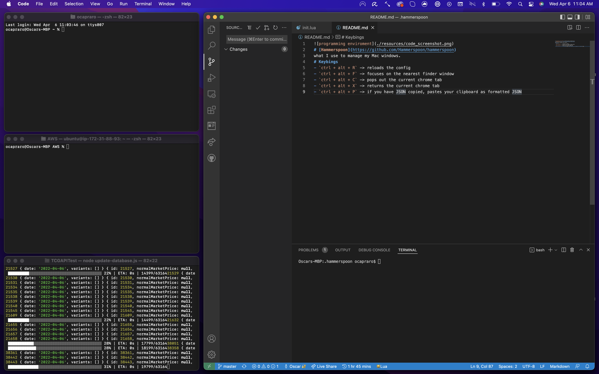

# [Hammerspoon](https://github.com/Hammerspoon/hammerspoon)
what I use to manage my Mac windows.
# Keybings
- ``ctrl + alt + R `` reloads the confi
- ``ctrl + alt + F `` focuses on the nearest finder window
